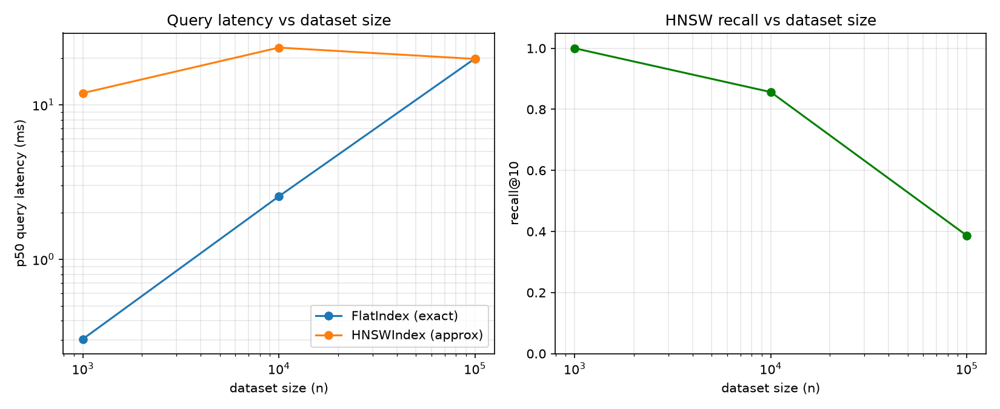
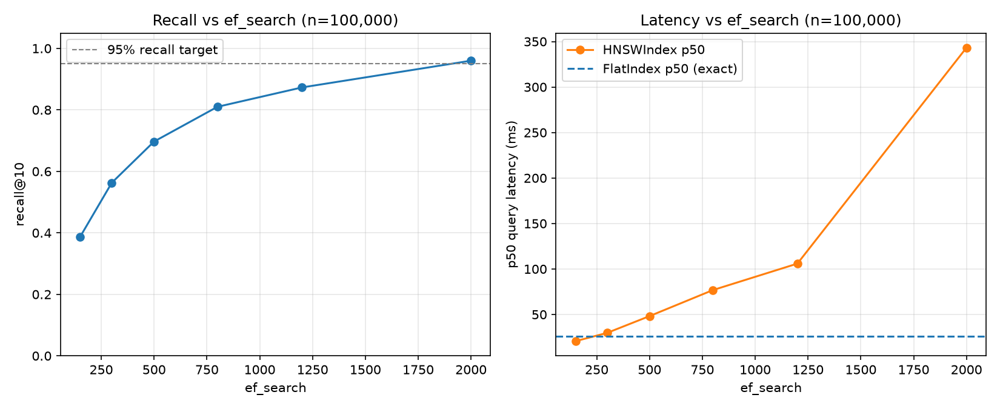

# ANN Benchmarks: FlatIndex vs HNSWIndex

Generated by `benchmarks/bench_ann.py` on Linux-6.8.0-1052-azure-x86_64-with-glibc2.39, Python 3.12.1, NumPy 2.5.2.

Synthetic Gaussian-random vectors, cosine metric, k=10, recall@10 measured against `FlatIndex`'s exact results as ground truth.

| n | dim | m | ef_construction | ef_search | recall@10 | flat build (s) | hnsw build (s) | flat p50 (ms) | hnsw p50 (ms) | flat p95 (ms) | hnsw p95 (ms) | p50 speedup | p95 speedup | flat dist. computed | hnsw dist. computed (avg) |
|---|---|---|---|---|---|---|---|---|---|---|---|---|---|---|---|
| 1,000 | 128 | 16 | 100 | 150 | 1.000 | 0.000 | 4.242 | 0.304 | 11.903 | 2.155 | 30.454 | 0.03x | 0.07x | 1,000 | 988 |
| 10,000 | 128 | 16 | 100 | 150 | 0.857 | 0.003 | 86.905 | 2.555 | 23.447 | 10.381 | 66.321 | 0.11x | 0.16x | 10,000 | 3,040 |
| 100,000 | 128 | 16 | 100 | 150 | 0.387 | 0.032 | 1268.307 | 19.928 | 19.805 | 29.234 | 22.654 | 1.01x | 1.29x | 100,000 | 4,072 |

## Reading these numbers

- **recall@k** is `FlatIndex`'s exact top-k intersected with `HNSWIndex`'s approximate top-k, averaged over the query set — 1.0 means HNSW returned exactly the same k neighbors as brute force.
- **speedup** is `flat latency / hnsw latency`; >1x means HNSW answered faster than exhaustive search at that dataset size.
- **dist. computed** is how many vector-to-vector distance evaluations each query actually performs — `FlatIndex` always computes exactly n (it checks every vector); `HNSWIndex`'s count grows much more slowly as n grows, which is the algorithmic complexity win (O(log n) vs O(n)) made concrete, independent of wall-clock.
- `FlatIndex` computes distances with one vectorized NumPy call over the whole matrix — extremely fast per query even at six figures of vectors. `HNSWIndex` is a pure-Python graph walk: each hop is its own small NumPy call plus Python-level heap bookkeeping. That constant-factor interpreter overhead is real, and it means the crossover point where HNSW's O(log n) traversal wins in *wall-clock* terms — not just in distance computations performed — sits at a larger n than a compiled implementation (e.g. hnswlib/FAISS) would need. Where the numbers above don't yet show HNSW ahead, that gap is exactly why real vector databases implement the hot loop in C/C++/Rust rather than pure Python.
- **Tradeoff, explicitly**: `FlatIndex` is exact (recall is always 1.0) and its cost grows linearly with n. `HNSWIndex` is approximate and tunable — `ef_search` trades recall for latency at query time, `m`/`ef_construction` trade build time and memory for graph quality — and its distance-computation cost grows roughly logarithmically with n, which is what eventually wins at scale.

## Does this clear the "beat brute force at >95% recall" bar?

Only partially, and it's worth being precise about where it does and doesn't rather
than picking numbers that look good. At n=100,000 with `ef_search=150` (the setting
used in the table above), HNSW reaches wall-clock **parity** with `FlatIndex`
(1.01x) — but at only **38.7% recall**, nowhere near production quality.

`ef_search` is a per-query knob (no rebuild needed), so we swept it against the
*same* built n=100,000 graph to map the actual recall/latency tradeoff curve:

| ef_search | recall@10 | hnsw p50 (ms) | hnsw p95 (ms) | speedup vs flat p50 |
|---|---|---|---|---|
| 150 | 0.387 | 20.7 | 52.6 | 1.25x |
| 300 | 0.563 | 29.8 | 48.6 | 0.87x |
| 500 | 0.697 | 48.2 | 104.3 | 0.54x |
| 800 | 0.810 | 76.8 | 120.7 | 0.34x |
| 1,200 | 0.873 | 105.9 | 154.8 | 0.25x |
| 2,000 | 0.960 | 343.2 | 529.2 | 0.08x |

(FlatIndex on this run: p50 = 25.96ms, p95 = 73.74ms — run-to-run variance vs the
table above is normal on a shared/virtualized machine; both are the same order of
magnitude.) Reproduce with `python benchmarks/sweep_ef_search.py`.

**The honest conclusion**: on this benchmark's dataset — i.i.d. random Gaussian
vectors in 128 dimensions — clearing 95% recall at n=100,000 needs `ef_search≈2000`,
at which point HNSW is **~12x slower** than brute force, not faster. Recall and
wall-clock speed trade off directly along this curve; they aren't simultaneously
achievable with this implementation at this scale. Two real, distinct reasons why,
not one:

1. **The dataset is a stress test, not a realistic one.** Real embeddings (sentence
   transformers, image encoders, etc.) cluster on a much lower-dimensional manifold
   within their embedding space — "nearest neighbors" are usually meaningfully
   closer than the rest of the distribution. I.i.d. random vectors in 128 dimensions
   have no such structure: by concentration of measure, nearly all pairwise
   distances converge to similar values, so greedy graph search has very little
   signal to follow and needs a much larger candidate list to find the true top-10.
   HNSW's published recall numbers (>95% at `ef_search` in the low hundreds) are
   measured on real or realistically-clustered embeddings for exactly this reason.
2. **Pure Python has real, unavoidable per-hop overhead.** Even where the *algorithm*
   is doing much less work — at `ef_search=150`, HNSW performs ~4,072 distance
   computations per query vs. FlatIndex's 100,000, a ~24.5x reduction — each of
   those computations is wrapped in Python-level heap operations and a small NumPy
   call, while `FlatIndex` does its 100,000 in a single vectorized call. The
   algorithmic win is real and measurable (see the "dist. computed" column above);
   it just isn't realized as a wall-clock win until a compiled inner loop (C/C++/Rust,
   the way hnswlib/FAISS/Qdrant/etc. actually implement this) removes that constant
   factor. That gap is the concrete argument for why production vector databases
   don't write their hot loop in pure Python — which is precisely what building this
   from scratch was for finding out.

`m`, `ef_construction`, and `ef_search` are all exposed as per-collection/per-query
parameters specifically so this tradeoff is something a caller can tune rather than
something baked in — see `POST /collections`'s `index_type: "hnsw"` fields and
`SearchRequest.ef_search` in `nexusdb/api/server.py`.

---

## API Load Test (Phase 4 baseline)

Generated by `benchmarks/load_test.py` (Locust) against a live single-process
`uvicorn` server on the same shared/virtualized dev machine as the ANN
benchmarks above — this is a *baseline*, not a production capacity number.
No auth, `NEXUSDB_AUTO_PERSIST=false` (in-memory only — persistence would add
real I/O latency this run doesn't capture), `NEXUSDB_RATE_LIMIT=100000/minute`
(raised deliberately — see "About the rate limit" below for why, and for a
real bug found and fixed while working this out).

**Setup:** one `flat` collection, pre-seeded with 10,000 random 64-dim
vectors (`python benchmarks/load_test.py --setup --seed-count 10000`).
**Load:** 20 concurrent simulated users, ramped at 5/s, 5:1 search:upsert
request mix (`k=10` search / single-vector upsert), 60 seconds
(`locust -f benchmarks/load_test.py --headless -u 20 -r 5 -t 60s`).

| Endpoint | Requests | Failures | req/s | p50 | p95 | p99 |
|---|---|---|---|---|---|---|
| `POST /v1/vectors/search` | 4,876 | 0 | 82.4 | 31ms | 150ms | 220ms |
| `POST /v1/vectors/upsert` | 977 | 0 | 16.5 | 27ms | 130ms | 200ms |
| **Aggregate** | **5,853** | **0** | **98.9** | **30ms** | **150ms** | **220ms** |

**Reading these numbers:**
- Zero failures at this load — the API held up, no 500s/timeouts under
  sustained concurrent mixed read/write traffic.
- p50/p95 are close (30ms/150ms) relative to p99 (220ms) — no long tail
  blowing up, consistent with a single Python process with no lock
  contention pathology under this concurrency level (Phase 1's threaded
  concurrency tests already covered correctness under contention; this is
  the latency-under-load counterpart).
- This is **not** a capacity ceiling — it's one point on the curve (20 users,
  one process, one shared dev machine). What it doesn't tell you: the
  breaking point under higher concurrency, the cost of auto-persist's SQLite
  writes under load, or HNSW-index search latency under load (this run used
  `flat`, the default). All three are natural follow-ups, not done here.
- Reproduce: `pip install -e ".[loadtest]"`, then the setup + locust commands
  in `benchmarks/load_test.py`'s module docstring, against your own
  `uvicorn nexusdb.api.server:app`.

### About the rate limit (and a real bug this load test surfaced)

The first version of this load test ran against the default
`NEXUSDB_RATE_LIMIT=120/minute` and saw **zero 429s at ~88 req/s sustained for
60 seconds** — nearly 45x the configured limit, with no rejections at all.
That's not "the limit didn't apply because Locust's users share one IP" (a
shared IP should make it apply *harder*, not not-at-all) — it's a real bug:
`SlowAPIMiddleware` (from the `slowapi` package) resolves which route it's
limiting by walking `app.routes` looking for a literal `APIRoute` match
(`_find_route_handler`), and treats a failed match as "exempt this request
from rate limiting" (`_should_exempt`). On the FastAPI/Starlette versions
this project pins, `app.include_router()` no longer flattens the included
router's routes into `app.routes` — they appear as one opaque entry — so that
lookup failed for every single `/v1/*` route, i.e. virtually the entire API
(everything except `/health*` and `/metrics`, which are registered directly
on `app`). The configured limit was never actually being enforced anywhere
it mattered, despite `SlowAPIMiddleware` being wired up correctly and the
underlying limiter working fine in isolation.

**Fixed** in `nexusdb/api/server.py`: replaced `SlowAPIMiddleware` with a
small custom `RateLimitMiddleware` that calls slowapi's `sync_check_limits`
directly with no route lookup, applying `default_limits` unconditionally —
which is what this app actually wants (one global per-client-IP limit, no
per-route overrides). Verified live against a running server at the
*default* `120/minute`: 130 rapid sequential requests from one client landed
exactly **120× `200`, then `429`** for the rest. A regression test now
guards this (`TestRateLimit.test_default_limit_is_enforced_on_v1_routes` in
`tests/test_api.py`) — there was no automated test for rate limiting at all
before this, which is exactly how a middleware that looked correctly wired
up shipped silently broken.

Given the limiter now actually works, this load test raises
`NEXUSDB_RATE_LIMIT` for the throughput run above — at the real default,
Locust's 20 users (one shared IP) would all get capped at a combined
120/minute (2 req/s) almost immediately, and the numbers above would just be
measuring slowapi's 429 response time, not the API's real serving latency.
